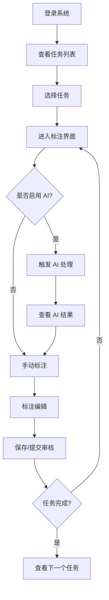
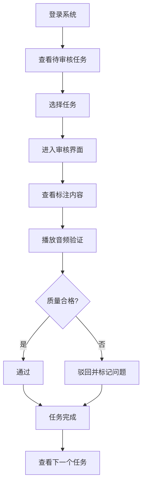

# Audio Label Pro - 产品需求文档（PRD）

> **文档版本**: v1.0
> **创建日期**: 2026-02-13
> **最后更新**: 2026-02-13
> **产品类型**: SaaS

---

## 1. 产品概述

### 1.1 产品定位

Audio Label Pro 是一个专业的基于 Web 的语音数据标注平台，专为团队协作设计。该平台支持大规模语音数据的标注、审核和管理工作，为机器学习模型训练提供高质量标注数据。

### 1.2 目标用户

| 用户角色 | 描述 | 核心需求 |
|---------|------|---------|
| **标注员** | 执行语音标注任务 | 高效的标注工具、AI 辅助、快速导航 |
| **审核员** | 审核标注质量 | 质量检查工具、审核流程、问题标记 |
| **项目管理员** | 管理项目、分配任务 | 任务管理、进度跟踪、统计分析 |
| **系统管理员** | 管理用户、配置系统 | 用户管理、系统配置、监控维护 |

### 1.3 核心价值主张

- **高效标注**: AI 辅助标注（ASR、说话人分离、智能推荐），提升标注效率 3-5 倍
- **团队协作**: 实时多人协作编辑，支持协作者光标、编辑锁定、评论系统
- **长音频支持**: 优化 10+ 小时音频处理，采用分块架构、多级波形、流式 AI 推送
- **质量可控**: 完整的审核流程、质量评分、问题标记机制
- **数据可视化**: 热力图展示标注密度、说话人分布、频谱分析

### 1.4 技术栈

| 层级 | 技术 | 用途 |
|------|------|------|
| **前端** | Vue 3 + TypeScript + Vite | 核心框架 |
| **前端** | Element Plus | UI 组件库 |
| **前端** | Tailwind CSS | CSS 框架 |
| **前端** | WaveSurfer.js | 波形可视化 |
| **前端** | Socket.io Client | 实时通信 |
| **前端** | ECharts | 图表可视化 |
| **后端** | NestJS + Fastify | 应用框架 |
| **后端** | TypeORM | ORM |
| **后端** | PostgreSQL | 关系数据库 |
| **后端** | Redis | 缓存/队列 |
| **后端** | Socket.io | WebSocket |
| **后端** | Bull | 任务队列 |
| **后端** | MinIO | 对象存储 |
| **AI服务** | Python + FastAPI + PyTorch | AI 框架 |
| **AI服务** | Whisper | ASR 语音识别 |
| **AI服务** | Pyannote.audio | 说话人分离 |

---

## 2. 功能需求

### 2.1 核心功能清单

| 功能模块 | 功能点 | 优先级 | 状态 |
|---------|--------|--------|------|
| **音频管理** | 音频上传（批量/拖拽/文件夹） | P0 | 待开发 |
| **音频管理** | 音频预览（波形图） | P0 | 待开发 |
| **音频管理** | 文件夹管理 | P1 | 待开发 |
| **音频管理** | 元数据管理 | P1 | 待开发 |
| **播放器** | 基础控制（播放/暂停/停止/跳转） | P0 | 待开发 |
| **播放器** | 波形显示（缩放/平移） | P0 | 待开发 |
| **播放器** | 播放速度（0.5x ~ 2x） | P1 | 待开发 |
| **播放器** | 跳转控制（精确时间/标注） | P1 | 待开发 |
| **播放器** | 循环播放（A-B 循环） | P1 | 待开发 |
| **播放器** | 音量调节 | P1 | 待开发 |
| **标注功能** | 时间区间选择 | P0 | 待开发 |
| **标注功能** | 标注绑定（文本/标签/说话人） | P0 | 待开发 |
| **标注功能** | 多层标注 | P1 | 待开发 |
| **标注功能** | 文本转写编辑 | P1 | 待开发 |
| **标注功能** | 标签体系 | P1 | 待开发 |
| **AI辅助** | 自动语音识别（ASR） | P0 | 待开发 |
| **AI辅助** | 说话人分离 | P0 | 待开发 |
| **AI辅助** | 自动分段 | P1 | 待开发 |
| **AI辅助** | 智能标签推荐 | P1 | 待开发 |
| **AI辅助** | 噪音检测 | P1 | 待开发 |
| **AI辅助** | AI 模型管理 | P1 | 待开发 |
| **热力图** | 标注密度热力图 | P0 | 待开发 |
| **热力图** | 说话人分布热力图 | P1 | 待开发 |
| **热力图** | 频谱热力图 | P1 | 待开发 |
| **热力图** | 交互查看 | P1 | 待开发 |
| **实时协作** | 多人协作编辑 | P0 | 待开发 |
| **实时协作** | 编辑锁定 | P1 | 待开发 |
| **实时协作** | 协作者光标 | P1 | 待开发 |
| **实时协作** | 评论系统 | P1 | 待开发 |
| **实时协作** | 消息通知 | P1 | 待开发 |
| **实时协作** | 版本控制 | P1 | 待开发 |
| **质量控制** | 审核流程 | P1 | 待开发 |
| **质量控制** | 问题标记 | P1 | 待开发 |
| **质量控制** | 质量评分 | P2 | 待开发 |
| **任务管理** | 任务创建 | P1 | 待开发 |
| **任务管理** | 任务分配 | P1 | 待开发 |
| **任务管理** | 进度跟踪 | P1 | 待开发 |
| **任务管理** | 统计报表 | P2 | 待开发 |
| **数据导出** | 格式支持（JSON/CSV/TXT/SRT/VTT/XML） | P1 | 待开发 |
| **数据导出** | 批量导出 | P1 | 待开发 |
| **用户权限** | 用户注册/登录 | P0 | 待开发 |
| **用户权限** | 角色管理 | P0 | 待开发 |
| **用户权限** | 团队管理 | P1 | 待开发 |
| **长音频优化** | 音频分块架构 | P1 | 待开发 |
| **长音频优化** | 多级波形渲染 | P1 | 待开发 |
| **长音频优化** | AI 流式推送 | P1 | 待开发 |
| **长音频优化** | 时间范围标注加载 | P1 | 待开发 |

### 2.2 功能优先级说明

- **P0（必须有）**: MVP 核心功能，第一版本必须实现
- **P1（应该有）**: 重要功能，第二版本实现
- **P2（可以有）**: 增强功能，后续版本迭代

---

## 3. 非功能性需求

### 3.1 性能要求

| 指标 | 要求 | 验证方法 |
|------|------|---------|
| 音频加载 | 10MB以内音频加载时间 < 3秒 | 性能测试 |
| 波形渲染 | 波形渲染时间 < 2秒 | 性能测试 |
| 实时同步延迟 | < 500ms | 延迟测试 |
| 并发用户 | 单项目支持 50+ 并发协作 | 压力测试 |
| 长音频加载 | 10小时音频初始加载 < 3秒 | 性能测试 |
| 波形渲染帧率 | 保持 60fps 流畅度 | 性能测试 |
| AI 处理进度更新 | 延迟 < 1秒 | 延迟测试 |
| 标注范围加载 | 时间 < 500ms | 性能测试 |
| 内存占用 | < 300MB | 内存测试 |

### 3.2 兼容性要求

| 类型 | 要求 |
|------|------|
| 浏览器 | Chrome 90+、Firefox 88+、Safari 14+、Edge 90+ |
| 音频格式 | MP3、WAV、FLAC、OGG、M4A、WebM |
| 操作系统 | Windows 10+、macOS 10.15+、Linux |

### 3.3 安全要求

- 数据传输加密（HTTPS）
- 敏感数据存储加密
- 防止 SQL 注入、XSS 攻击
- 定期数据备份
- 访问频率限制

### 3.4 可用性要求

- 系统可用性 ≥ 99.5%
- 界面响应时间 < 200ms
- 支持 4 种语言（中文、英文、日文、韩文）

---

## 4. 用户流程

### 4.1 标注员工作流程

### 4.2 审核员工作流程

---

## 5. 页面清单

### 5.1 核心页面列表

| 页面名称 | 路径 | 描述 | 关联角色 |
|---------|------|------|---------|
| **登录页** | `/login` | 用户登录 | 所有角色 |
| **注册页** | `/register` | 用户注册 | 所有角色 |
| **首页** | `/` | 项目/任务概览 | 所有角色 |
| **项目列表** | `/projects` | 项目列表页 | 所有角色 |
| **项目详情** | `/projects/:id` | 项目信息 | 所有角色 |
| **音频列表** | `/projects/:id/audio` | 音频文件管理 | 标注员、管理员 |
| **标注界面** | `/audio/:id/annotate` | 核心标注页面 | 标注员、审核员 |
| **审核界面** | `/audio/:id/review` | 标注审核页面 | 审核员 |
| **任务列表** | `/tasks` | 任务列表 | 标注员、审核员 |
| **任务详情** | `/tasks/:id` | 任务信息 | 所有角色 |
| **统计报表** | `/reports` | 统计报表 | 管理员 |
| **团队管理** | `/team/:id` | 团队成员管理 | 管理员 |
| **用户管理** | `/admin/users` | 用户管理 | 系统管理员 |
| **设置页** | `/settings` | 个人/项目设置 | 所有角色 |
| **导出页面** | `/export` | 数据导出 | 所有角色 |

### 5.2 页面详细说明

#### 5.2.1 登录页 (`/login`)

**页面元素**:
- Logo 和产品名称
- 登录表单（邮箱/用户名、密码）
- "忘记密码" 链接
- "注册" 链接
- "记住我" 复选框
- 社交登录按钮（可选）

**交互说明**:
- 输入框实时验证（邮箱格式、密码长度）
- 点击登录后验证凭证
- 验证成功跳转到首页
- 验证失败显示错误提示

#### 5.2.2 首页 (`/`)

**页面元素**:
- 顶部导航栏（Logo、项目切换、用户菜单）
- 左侧边栏（导航菜单）
- 主内容区：
  - 项目概览卡片（项目数量、进行中任务、已完成任务）
  - 最近任务列表
  - 快捷操作按钮（新建项目、上传音频）
  - 协作提醒（@ 提及、评论回复）

**交互说明**:
- 点击项目卡片跳转到项目详情
- 点击任务跳转到标注/审核界面
- 点击通知打开通知中心

#### 5.2.3 标注界面 (`/audio/:id/annotate`) ⭐ 核心页面

**页面元素**:
- **顶部工具栏**:
  - 音频信息（文件名、时长）
  - 播放控制（播放/暂停/停止）
  - 播放速度选择器
  - 音量控制
  - 保存状态指示
  - 提交审核按钮

- **主工作区**:
  - 分段导航面板（长音频）
  - 波形显示区（多级波形、标注色块）
  - 时间轴标尺
  - 协作者光标显示
  - 评论标记图标

- **右侧面板**:
  - 标注列表
  - 标注编辑器
  - 标注层管理
  - 说话人列表
  - 标签选择器
  - AI 处理进度
  - 在线协作者

- **底部面板**:
  - 热力图视图（标注密度、说话人分布、频谱）
  - 播放进度条
  - A-B 循环标记

**交互说明**:
- 点击波形创建/编辑标注
- 拖动选区调整时间区间
- 双击波形播放
- 滚轮缩放波形
- 拖动波形平移视图
- 点击热力图跳转时间点
- 右键打开上下文菜单

#### 5.2.4 音频列表 (`/projects/:id/audio`)

**页面元素**:
- 顶部工具栏（上传音频、新建文件夹、批量操作）
- 文件夹树形导航
- 文件列表（表格/网格视图）
- 过滤器（状态、格式、说话人）
- 批量操作菜单

**交互说明**:
- 拖拽文件上传
- 点击文件进入标注界面
- 右键菜单（重命名、移动、删除）
- 批量选择和多选操作

#### 5.2.5 审核界面 (`/audio/:id/review`)

**页面元素**:
- 与标注界面相似布局
- 额外添加：
  - 审核工具栏（通过/驳回按钮）
  - 驳回原因输入框
  - 问题标记面板
  - 质量评分显示

**交互说明**:
- 查看标注内容
- 播放音频验证
- 添加问题标记
- 通过或驳回标注

#### 5.2.6 任务列表 (`/tasks`)

**页面元素**:
- 任务过滤器（状态、优先级、分配者）
- 任务列表（卡片/表格视图）
- 任务统计图表
- 批量操作

**交互说明**:
- 点击任务进入详情
- 筛选和搜索任务
- 查看任务进度

---

## 6. 数据模型

### 6.1 核心实体

| 实体 | 描述 | 主要字段 |
|------|------|---------|
| **User** | 用户 | id, email, username, password_hash, avatar_url, role |
| **Team** | 团队 | id, name, description, owner_id |
| **Project** | 项目 | id, team_id, name, description, status |
| **AudioFile** | 音频文件 | id, project_id, file_name, file_path, duration, format |
| **Annotation** | 标注 | id, audio_id, start_time, end_time, text, speaker_id |
| **AnnotationLayer** | 标注层 | id, audio_id, name, type, color |
| **Speaker** | 说话人 | id, project_id, name, color |
| **Tag** | 标签 | id, project_id, name, type, color |
| **Comment** | 评论 | id, audio_id, user_id, content, start_time |
| **Task** | 任务 | id, project_id, name, assigned_to, status, progress |
| **AIJob** | AI 处理任务 | id, audio_id, job_type, status, model_name |

### 6.2 关键关系

- User → Team (多对多)
- Team → Project (一对多)
- Project → AudioFile (一对多)
- AudioFile → Annotation (一对多)
- Annotation → Speaker (多对一)
- Annotation → Tag (多对多)
- Project → Task (一对多)
- AudioFile → AIJob (一对多)

---

## 7. 验收标准

### 7.1 MVP（第一版本）验收标准

- [ ] 用户能注册登录系统
- [ ] 用户能上传音频并看到波形
- [ ] 用户能创建、编辑、删除时间戳标注
- [ ] AI 能自动转写音频并显示置信度
- [ ] 热力图能正确显示标注密度分布
- [ ] 多人能同时编辑并实时同步
- [ ] 支持导出 JSON、CSV、SRT 格式
- [ ] 响应时间符合性能要求

### 7.2 长音频场景验收标准

- [ ] 10小时音频初始加载时间 < 3秒
- [ ] 波形渲染保持 60fps 流畅度
- [ ] AI 处理进度实时更新（延迟 < 1秒）
- [ ] 标注范围加载时间 < 500ms
- [ ] 内存占用 < 300MB
- [ ] 支持 20+ 用户同时协作编辑长音频
- [ ] 分段导航功能正常工作
- [ ] 多级波形缩放平滑无卡顿

---

## 8. 风险与限制

### 8.1 技术风险

| 风险 | 影响 | 应对措施 |
|------|------|---------|
| 长音频处理性能影响用户体验 | 高 | 采用分块架构、多级波形、流式加载 |
| 实时协作可能出现冲突 | 中 | 实现编辑锁定、版本控制 |
| AI 处理时间过长 | 中 | 流式推送、断点续传 |

### 8.2 业务限制

- 单个音频文件最大 10GB
- 单项目最多支持 100 个并发用户
- AI 模型处理队列限制（默认 10 个并发）

---

## 9. 未来规划

### 9.1 第二阶段功能

- 高级标注功能（自定义标签库）
- 智能标签推荐优化
- 评论与通知系统完善
- 任务管理增强

### 9.2 第三阶段功能

- 质量控制系统完善
- 高级统计分析
- API 接口开放
- 性能深度优化

---

**文档结束**